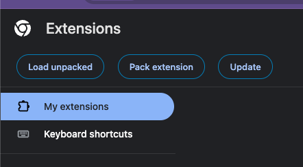
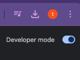
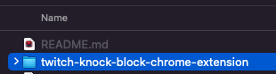
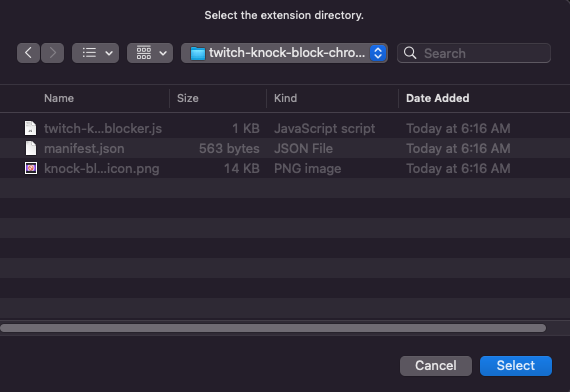
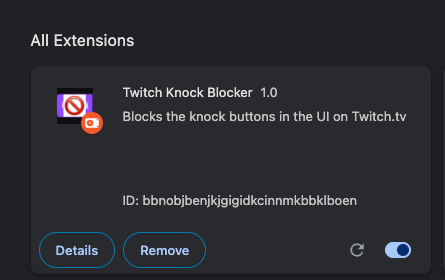
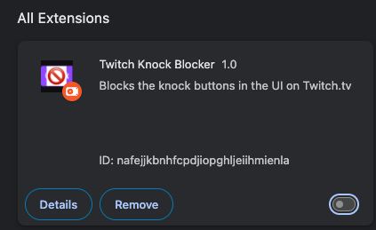

# *Knock Blocker!!!*

A simple Chrome extension which removes the intrusive "Knock" buttons on the twitch.tv web UI.
Please contribute ideas and feedback on [KnockBlocker GitHub Page](https://github.com/thaMANSTA/knock-blocker)! Snooch to the Nooch!

## Open Chrome Extensions:

1. Open Chrome and navigate to `chrome://extensions/`
   

2. Enable Developer Mode by toggling the switch in the upper-right corner
   

## Load the Unpacked Extension:

1. Click on “Load Unpacked”
   

2. select the “knock-blocker-chrome-extension” folder.
   

3. select the folder to load the Extension
   

4. The Extension should now be loaded
   

## Test on the Twitch.va Website:

1. Navigate to a Twitch.tv page of a streamer whose stream normally has Knock buttons when you enter.

2. If there were any buttons with “Knock” in their text, they should now be hidden from view.

## I need the Knock Buttons Back!

- You can simply disable this extension using the toggle in Manage Extensions!
  

**Disclaimer:**  
_This project is an independent initiative and is not affiliated with, endorsed by, sponsored by, or in any way
officially connected to **Twitch Interactive, Inc.** All trademarks, service marks, and logos mentioned herein are the
property of their respective owners. The use of any such marks does not imply any association with or endorsement by
Twitch Interactive, Inc._ 
